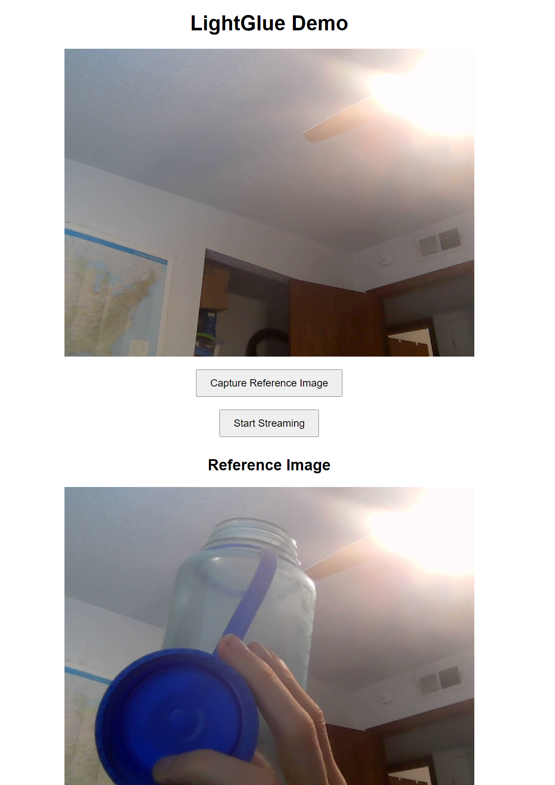
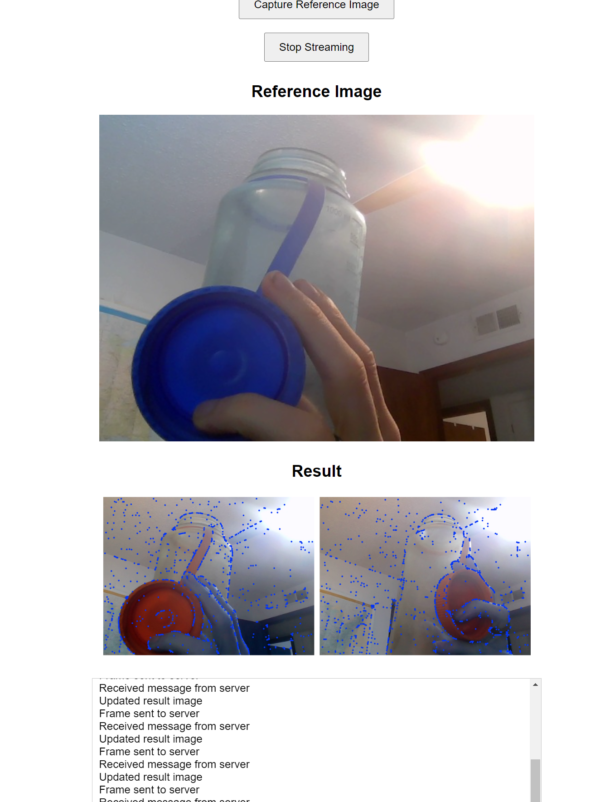

# README for Simple FastAPI App (Version 2)

 ## SUPER GLUE -> Light GLUE

**Playing Around with Image Matching using FastAPI**

This project is a proof-of-concept for building an image matching application using FastAPI. The current implementation is a simple example of how to set up a FastAPI app to match images.

## Background

This project started as a basic Gradio application (`gradio_app/gradio_app.py`), but we decided to move to a FastAPI app (`simple_fastapi_app_v2/main.py`) to explore its capabilities. This README focuses on the FastAPI app.

## How it Works

The app uses WebSockets to establish a connection with the client. The client sends an image to the server, which then matches the image with a reference image set by the user. The matched image is then sent back to the client.

Here's a high-level overview of the process:

1. The user sets a reference image by sending a POST request to the `/set_reference` endpoint.
2. The client sends an image to the server via a WebSocket connection.
3. The server decodes the image and matches it with the reference image using the `match_images` function.
4. The matched image is then sent back to the client via the WebSocket connection.

## Code

The code is divided into two main files:

* `simple_fastapi_app_v2/main.py`: This file contains the FastAPI app logic, including the WebSocket endpoint and the `match_images` function.
* `gradio_app/gradio_app.py`: This file contains the basic Gradio app implementation, which was used as a starting point for the FastAPI app.

## Future Work

This is just a proof-of-concept, and there's plenty of room for improvement. Some ideas for future work include:

* Refining the image matching algorithm to improve accuracy.
* Adding more features to the app, such as image filtering or text recognition.
* Improving the user experience by adding a front-end interface.

## Running the App

To run the app, you'll need to install FastAPI and other dependencies. We recommend using a virtual environment to manage dependencies. Once you've set up your environment, you can run the app using the following command:

```bash
uvicorn simple_fastapi_app_v2.main:app --host 0.0.0.0 --port 8000
```

You can then access the app at `http://localhost:8000`. To set the reference image, send a POST request to `http://localhost:8000/set_reference` with the image attached as a file.

Note that this is just a start, and we encourage you to explore and contribute to this project as you see fit.


## Example

```bash
cd simple_fastapi_app_v2
uvicorn main:app --host 0.0.0.0 --port 8000 --reload

```

Take an iamge. 


then stream. 


